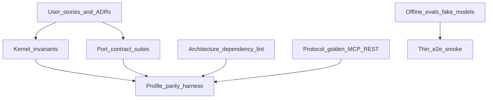

# Kotowari Quality Assurance

**Product:** Kotowari
**Repo:** `kotowari`
**Audience:** implementers, Cursor Cloud agents, and reviewers who must decide whether a slice is actually done
**Companion:** [product-design.md](./product-design.md) (stories S1–S18) · [system-design.md](./system-design.md) (architecture) · [ADRs](./ADRs/README.md) (irreversible choices)

This document is **not** a unit-test and e2e checklist. It is the **behavior-guarantee system**: executable proofs derived from product stories and ADRs, enforced in CI so a Cursor Cloud agent cannot merge “looks done” code that violates the product.

**Rule:** “I added unit tests” is never sufficient. A slice is done when the **gates for that slice** are green.

---

## 1. Why this shape

A thicker pyramid (more Playwright, higher coverage %) does not guarantee Kotowari. End-to-end UI tests are slow, flaky, and easy for coding agents to stub or skip. Formal methods are strong proofs but a poor fit for Cloud-agent iteration. LLM-as-judge on every PR is nondeterministic.

Kotowari guarantees behavior with a **contract / invariant / architecture / parity kernel**:

- User stories and ADRs are the specification.
- Kernel invariants and port contracts are the proofs.
- Architecture lint stops boundary violations that TypeScript will still compile.
- Profile parity proves standalone and Compose (later cloud) share semantics.
- E2E smoke is a thin last mile, not the source of truth.
- Retrieval and extraction **evals** use frozen corpora and fake or recorded models on PRs.

Gherkin/Cucumber is not the runtime. Story IDs (`S1`, `ADR-0007`) appear in **test names** so agents and humans can trace a failure back to the spec.

---

## 2. Guarantee model

Quality is a stack of **proofs**, not a folder of tests.



**What must remain true (product language)**

- A claim without evidence and provenance is not knowledge.
- A decision is a record with a context snapshot, not a log line and not hidden chain-of-thought.
- Retrieval never shows another tenant’s objects; omissions are explainable as policy.
- REST, MCP, and the SDK perform the same command with the same authorization.
- SQLite standalone and PostgreSQL Compose agree on semantic fixtures.
- Coding agents talk MCP/SDK; they do not import the kernel.

**How we prove it (engineering language)**

Shared suites live conceptually in `packages/plugin-sdk` (contract factories) and a repo-root `pnpm verify` (or equivalent) that Cloud agents and CI both run. This document describes those harnesses; it does not implement them.

---

## 3. Traceability

Every must-have proof maps to a story and/or ADR. Test titles include the IDs (example: `ADR-0007 rejects claim write without provenance`).

### 3.1 User stories → proofs

| Stories | Must remain true | Proof kind |
| --- | --- | --- |
| S1 | `npx kotowari init && kotowari start` serves web, REST, and MCP without Docker | E2E smoke + protocol golden (local HTTP/stdio) |
| S2 | Ingest then query returns claims linked to evidence | Port contract + fixture ingest + retrieval explanation |
| S3 | Decision survives process restart | Standalone persist test (SQLite file round-trip) |
| S4 | IDE plugin uses MCP only | Architecture: agent packs must not import `packages/kernel`; MCP golden |
| S5, S7 | Compose matches standalone semantics | **Profile parity harness** (same fixtures, same assertions) |
| S6 | Cloud promote does not change agent APIs | Protocol snapshots stay stable; Phase 3 smoke uses same commands |
| S8 | Audit view has snapshot, evidence, policy versions, actor, outcome | Kernel invariant + decision contract |
| S9 | Policy what-if lists affected past decisions | Policy capability tests + fixtures |
| S10 | Classified evidence omitted for unauthorized agent | ADR-0010 retrieve-empty + explanation `policy_filter` |
| S11 | Plugin configures stdio (standalone) or HTTP OAuth (enterprise) | Pack golden configs; MCP auth tests in Compose job |
| S12 | Coding agent does not see admin tools by default | MCP profile fixture: `/mcp/retrieve` tool list snapshot |
| S13 | MCP Apps are inspectors, not the only UI | Optional; do not block v1 core gates |
| S14 | `context.build({ purpose })` is bounded and snapshotted | Application command test + snapshot attached to decision |
| S15 | Shared workspace, isolated memory namespaces | Namespace isolation contract |
| S16 | Framework adapters stay thin | Architecture: adapters depend on SDK/protocol only |
| S17 | Conflict resolution recorded with provenance | Kernel write + provenance required |
| S18 | Re-extract from stored evidence, no origin SaaS | Ingest contract: extract from blob ids only |

### 3.2 ADRs → proofs

| ADR | Must-have proof |
| --- | --- |
| [0001](./ADRs/0001-kernel-capability-packs-ports.md) | `package-boundary.yaml`: `kernel` must not import `protocol-*`, Vertex, or Postgres. Architecture lint fails the PR. |
| [0002](./ADRs/0002-sql-canonical-projections.md) | **Same** `canonicalStoreComplianceTests(factory)` on SQLite and Postgres. Graph/vector are projections: deleting a projection and rebuilding does not change canonical claim ids. |
| [0003](./ADRs/0003-typescript-product-language.md) | Default `verify` does not require Python. Kernel package.json has no vendor ML deps. |
| [0004](./ADRs/0004-mcp-v2-transport.md) | Streamable HTTP requires `MCP-Protocol-Version`, `Mcp-Method`, `Mcp-Name`; header/body mismatch rejected. Tools invoke application commands, not kernel internals (architecture + a spy in protocol tests). Capability-scoped tool lists differ (`/mcp/retrieve` vs `/mcp/admin`). |
| [0005](./ADRs/0005-three-deployment-profiles.md) | Profile parity job: standalone process vs Compose app+Postgres+MinIO; identical semantic assertions. Compose does **not** assert GCP APIs. |
| [0006](./ADRs/0006-vertex-gemini-model-adapters.md) | `modelProviderComplianceTests` + `embeddingProviderComplianceTests` with a **fake** provider on every PR. Vertex plugin uses **recorded fixtures**; live Gemini is not a merge gate. |
| [0007](./ADRs/0007-provenance-mandatory.md) | Kernel **rejects** semantic writes without provenance (property test). Happy path always persists compact provenance fields. |
| [0008](./ADRs/0008-decisions-first-class.md) | Decision record requires context snapshot + evidence refs; payload with `chainOfThought` / hidden CoT field is rejected or ignored with test proving it is not stored. |
| [0009](./ADRs/0009-agent-plugins-thin-mcp.md) | Agent pack packages forbidden to depend on `kernel`. Skills/tool descriptors match JSON Schema snapshots (generated, CI fails on drift). |
| [0010](./ADRs/0010-namespaces-policy-authorization.md) | Cross-tenant retrieve returns no hits; explanation includes policy filter. `allow(principal, action, resource, context)` property tests. Standalone still has a real local principal (not “ACL off”). |

---

## 4. Test taxonomy

What each layer is **allowed** to prove. Using the wrong layer is a review failure, not extra credit.

| Layer | Proves | Runs in Cloud agent / default CI | Forbidden |
| --- | --- | --- | --- |
| **Kernel invariants** | Claim + evidence link + provenance + ACL metadata + outbox in one transaction; reject write without provenance; decision shape | Always, in-process, **no I/O** | Calling Vertex, opening a browser, “testing” MCP |
| **Port contracts** | `CanonicalStore`, `BlobStore`, `ModelProvider`, `EmbeddingProvider`, `KnowledgeSource`, `GraphProjection` via `*ComplianceTests(factory)` | SQLite + filesystem fake in default CI; Postgres + MinIO in Compose job | One-off adapter tests that skip the shared suite |
| **Architecture** | Dependency rules, `public.ts` is the only import surface, agent packs vs kernel | Always | “We’ll fix imports later”; relying on `tsc` alone |
| **Protocol golden** | OpenAPI snapshot; MCP tool JSON Schema snapshot; 2026-07-28 header mismatch; scoped tool lists | Always with fake model | Live Gemini; asserting UI pixels |
| **Profile parity** | Identical semantic fixtures on standalone vs Compose | Compose service in CI (Phase 2+) | Different expected JSON per profile except where the spec allows (identity UX) |
| **Retrieval / extract evals** | Quality vs frozen corpus + fake `ExtractionProvider` or recorded Vertex fixtures | PR: fixture replay only. Nightly: optional live eval, **advisory** | Flaky live-model gates on every PR |
| **E2E smoke** | `kotowari init/start`, ingest fixture, one sourced query, record decision | **One** path, minutes not hours | Replacing contracts with UI-only e2e; covering tenancy only in the browser |
| **Unit** | Pure functions, parsers, header mapping, score math | Yes | Using unit tests to “prove” tenancy, provenance-on-write, or MCP auth |

**Property-based tests** (fast-check or equivalent) are required for:

- `allow(principal, action, resource, context)` (ADR-0010)
- Bitemporal claim overlap / conflict detection
- Merge and retract of entities/claims
- Provenance required on a generated set of semantic write kinds (ADR-0007)

**Golden corpora** live under `testdata/` (when the repo exists): source documents, expected claims, expected retrieval explanations (`why selected`, policy filter, evidence ids). Agents extend corpora when they add behavior; they do not hard-code one-off expected strings in random unit tests.

---

## 5. Determinism for Cursor Cloud

Cursor Cloud agents run in isolated environments and open PRs. They will skip expensive or flaky steps unless **merge is impossible** without them.

**Default CI (every PR, including Cloud agent PRs)**

- **No network.** No Vertex, no OpenAI, no real IdP.
- Fake `ModelProvider` / `ExtractionProvider` implementing the plugin-sdk contract.
- `plugins/model-vertex` verified with **recorded request/response fixtures**, not live generate.
- SQLite canonical store + filesystem blob adapter.
- Architecture lint + kernel invariants + protocol goldens + unit + sqlite contracts + e2e smoke.

**LLM quality**

- Replay recorded model responses for extract/retrieve paths on PRs.
- Eval scores against frozen corpora are **advisory** unless they are fixture diffs (byte-stable explanations).
- Nightly job may call Vertex; a regression there opens an issue or a non-blocking check, not a silent Cloud-agent failure that trains agents to disable tests.

**Verify command**

A single entrypoint (name illustrative): `pnpm verify`

It must run the default gate set. Cloud agents and humans use the same command. Hooks and CI call it. **`--no-verify` and hook skip flags are not allowed on merge** (branch protection / required checks).

---

## 6. Cursor Cloud definition of done

Copy into Cloud agent prompts, PR templates, and `AGENTS.md` / plugin skills when the repo exists.

```text
You are implementing a Kotowari slice.

Done means:
1. Behavior matches the cited story IDs and ADR IDs.
2. If you change behavior, you update or add contract/invariant/golden tests in the same PR.
3. You run `pnpm verify` (or the repo’s equivalent) and paste the gate summary in the PR.
4. You do not claim done if architecture lint, provenance invariants, or contract tests fail.
5. You do not add live Vertex/network calls to default CI.
6. You do not import packages/kernel from protocol packs or agent plugins.
7. You do not prove tenancy, MCP, or profile parity with unit tests alone.
8. New ports implement plugin-sdk compliance factories; you do not write a parallel private test suite.

If verify is red, the slice is not done.
```

**PR body (required sections)**

- Stories / ADRs touched
- Gates run (paste `pnpm verify` output)
- New goldens or corpus files
- Residual risk (if any: live model, IAM, MCP host)

Reviewers reject PRs that only show “added tests in `__tests__/foo.test.ts`” without the matching layer from §4.

---

## 7. CI and merge gates by phase

Aligned with [system-design.md](./system-design.md) §17. Merge to default branch requires **default gates**. Cloud agents cannot skip them.

| Phase | Required on merge | Additional (non-blocking or later required) |
| --- | --- | --- |
| **0–1 Standalone** | Kernel invariants; SQLite + filesystem contracts; architecture lint; MCP/OpenAPI goldens; unit; e2e smoke (`init/start/ingest/query/decision`) | Retrieval fixture evals |
| **2 Compose** | All of 0–1 **plus** Postgres+MinIO contract job; **profile parity** (same semantic fixtures); dev-OIDC retrieve-deny tests | MCP HTTP OAuth against mock AS |
| **3 GCP** | All of 2 **plus** `terraform validate` / fmt / module contract; Cloud Run **smoke** of the same commands (staging) | Live Vertex nightly eval; IAM residual checklist |

**Job sketch (conceptual)**

```text
verify-default     # no network — required
verify-parity      # compose — required from Phase 2
verify-terraform   # required from Phase 3
eval-nightly       # fixtures + optional live — not required for Cloud agent merge
```

Parity assertions must be **identical** for knowledge write, provenance presence, decision round-trip, and policy-filtered retrieve. Allowed differences: login UX, worker as separate process, blob URLs.

---

## 8. Harnesses to implement later (specified now)

When code exists, these are the mechanical homes. Do not invent a second quality system.

| Harness | Role |
| --- | --- |
| `packages/plugin-sdk` `*ComplianceTests(factory)` | Port contracts; every adapter registers a factory |
| `packages/kernel` invariant suite | Provenance, atomic outbox, decision shape, namespace on write |
| `package-boundary.yaml` + CI architecture test | ADR-0001 / 0009 import rules |
| `testdata/` corpora + explanation goldens | S2, retrieval debugger, evals |
| `pnpm verify` | Default gate aggregator for humans and Cloud agents |
| Profile parity runner | Load fixture pack; run against standalone URL and Compose URL; diff semantic results |

Protocol tests may spy that `protocol-mcp` calls `application` commands only.

---

## 9. Residual risk (what we still do not guarantee)

| Risk | Why it is residual | Mitigation |
| --- | --- | --- |
| Live Gemini quality / drift | Nondeterministic; not a PR gate | Recorded fixtures on PR; nightly advisory eval |
| Third-party MCP host quirks (Cursor vs Claude vs VS Code) | Hosts differ; we own the server | Goldens for **our** protocol; manual host smoke when upgrading MCP SDK |
| GCP IAM / IAP edge cases | Compose reproduces contracts, not Google Cloud | Staging smoke + IAM review; not emulated locally |
| MCP Apps rendering in a given host | Extension support varies | Inspectors optional for v1 merge |
| Malicious L2/L3 plugins | v1 is L0/L1 trusted | Isolation levels in ADR-0001; out of default gates |
| Performance / huge graphs | Correctness first | Projection workers measured later; not a substitute for contracts |

These gaps are explicit so Cloud agents do not pretend e2e-on-GCP is required to finish a kernel slice—and so reviewers do not confuse a green `verify-default` with “Vertex is production-perfect.”

---

## 10. Document map

| If you need | Read |
| --- | --- |
| What users experience and story IDs | [product-design.md](./product-design.md) |
| How the system is built | [system-design.md](./system-design.md) |
| Why a technical choice is frozen | [ADRs](./ADRs/README.md) |
| How we prove behavior under Cursor Cloud | This document |
