# Kotowari System Design

**Product:** Kotowari
**Repo:** `kotowari`
**Audience:** implementers and coding agents
**Companion:** [product-design.md](./product-design.md) (what and why for users) · [ADRs](./adr/README.md) (irreversible choices)

This document is the technical contract for the TypeScript modular monolith: domain model, kernel, capability packs, ports/adapters, MCP 2026-07-28 (“MCP v2”), Google Cloud, Terraform modules, and agent plugins.

**Architectural rule:** Capabilities depend on semantic contracts. Semantic contracts never depend on products, clouds, databases, model vendors, agent frameworks, or protocols.

**Product-level rule:** SQLite standalone and enterprise PostgreSQL must expose the same semantic behavior, not necessarily the same physical implementation.

---

## 1. Goals and non-goals (engineering)

**Goals**

- One TypeScript codebase, one canonical data model, three deployment profiles.
- Canonical knowledge in SQL; graph, vector, FTS, and RDF as projections.
- MCP v2 and REST (and later A2A) as transports over the same application commands.
- Vertex AI Gemini as the first-class model adapter; other providers as plugins.
- Agent plugins (Cursor, Claude Code, Claude Agent SDK, …) stay thin.
- Heavy work is location-transparent: in-process today, Cloud Run Job / worker pool tomorrow, same domain contract.

**Non-goals (v1)**

- Kubernetes, required Neo4j/Neptune, dedicated vector DB, generic workflow DSL, in-house agent framework, in-house model gateway, AWS Terraform (later module set), lowest-common-denominator multi-cloud runtime.

Why: [ADR-0001](./adr/0001-kernel-capability-packs-ports.md), [ADR-0002](./adr/0002-sql-canonical-projections.md), [ADR-0005](./adr/0005-three-deployment-profiles.md).

---

## 2. System context

Humans, IDEs, application agents, and internal services all hit the same Kotowari application. Nothing in the kernel knows Vertex, AlloyDB, or MCP.

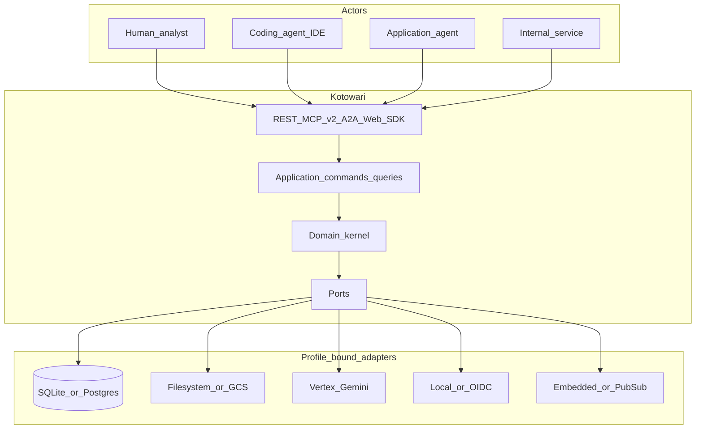

---

## 3. System architecture (logical)

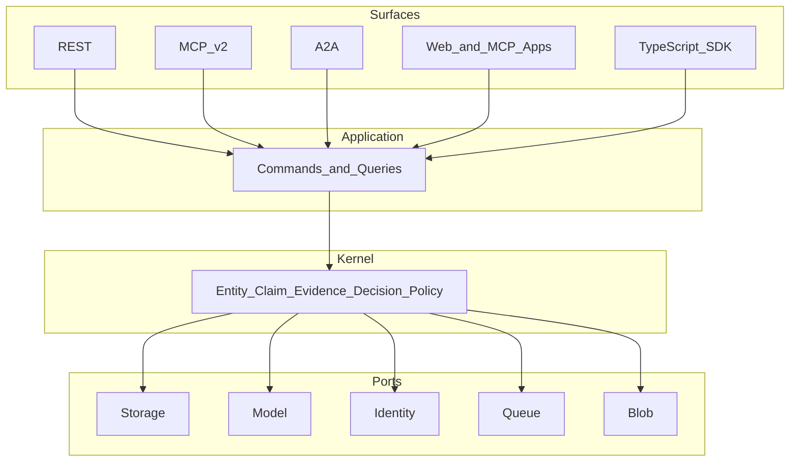

**Invariant:** MCP tools, REST handlers, SDK methods, and A2A tasks call `CQRS`. They do not contain business logic. Authorization and provenance therefore cannot diverge by transport. See [ADR-0004](./adr/0004-mcp-v2-transport.md).

---

## 4. Three deployment profiles

Same semantic API. Different bindings. Compose reproduces **contracts**, not Google Cloud APIs. See [ADR-0005](./adr/0005-three-deployment-profiles.md).

| Mode             | Runtime             | Canonical DB                  | Blobs      | Async                         | Identity        |
| ---------------- | ------------------- | ----------------------------- | ---------- | ----------------------------- | --------------- |
| Standalone       | single Node process | SQLite                        | filesystem | embedded queue                | local principal |
| Enterprise local | Docker Compose      | PostgreSQL                    | MinIO      | Redis/NATS-compatible adapter | dev OIDC        |
| Enterprise GCP   | Cloud Run           | AlloyDB or Cloud SQL Postgres | GCS        | Pub/Sub + Cloud Tasks + jobs  | OIDC / IAM      |

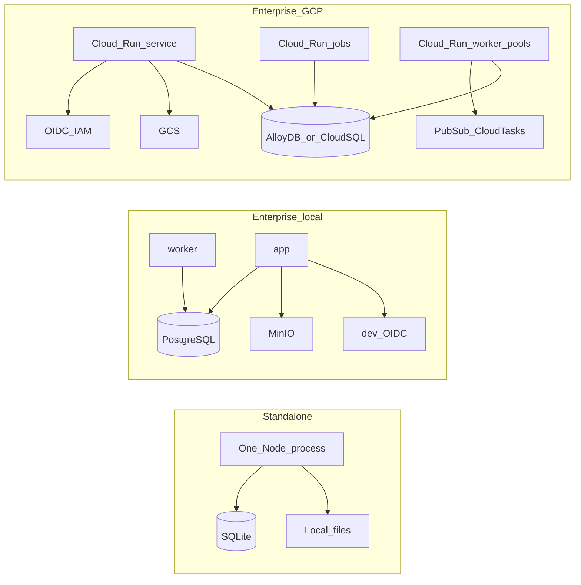

**Cloud Run mapping**

| Workload                                                              | Cloud Run kind |
| --------------------------------------------------------------------- | -------------- |
| REST, MCP HTTP, A2A, web/BFF                                          | Service        |
| Bulk ingest, re-embed, ontology migration, re-index, graph projection | Job            |
| Incremental indexing, connector drain, long consumers                 | Worker pool    |

Capabilities keep a `local executor` and a `distributed executor`. The domain contract does not change.

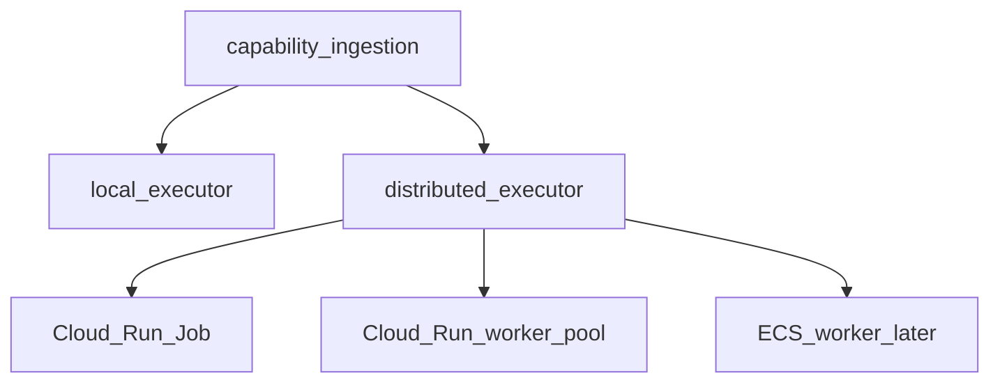

---

## 5. Software architecture

### 5.1 Package layout

Modest workspace count. Not 30 independent libraries.

```text
apps/
  server/          HTTP: REST, MCP Streamable HTTP, A2A, web BFF
  web/             first-party web application
  cli/             kotowari init | start | ingest | doctor
  worker/          job and queue consumers
packages/
  kernel/          entities, events, ACL hooks, invariants
  application/     commands, queries, use-case orchestration
  plugin-sdk/      typed capability interfaces + contract tests
  capability-knowledge/
  capability-context/
  capability-memory/
  capability-ingestion/
  capability-retrieval/
  capability-ontology/
  capability-policy/
  capability-provenance/
  adapter-sqlite/
  adapter-postgres/
  protocol-rest/
  protocol-mcp/
  protocol-a2a/
plugins/
  model-vertex/    Gemini on Vertex AI (default)
  model-openai/
  model-anthropic/
  model-openrouter/
  agent-cursor/
  agent-claude-code/
  agent-claude-sdk/
infra/
  terraform/modules/
  terraform/environments/
  compose/
```

### 5.2 Dependency rule

Enforced in CI (architecture tests / dependency lint). A TypeScript compile is not sufficient.

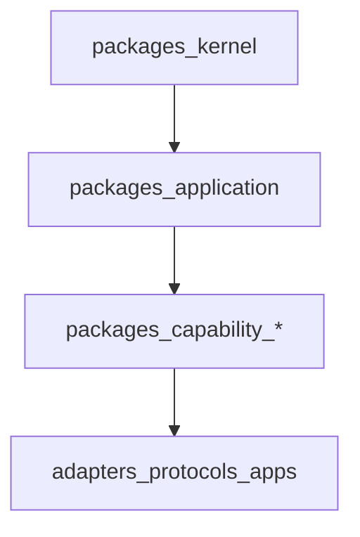

**Forbidden:** `kernel → MCP`, `kernel → Vertex AI`, `kernel → PostgreSQL`, `capability-knowledge → web`, `capability-policy → Cloud Run`.

Per-package machine-readable boundary (example):

```yaml
# package-boundary.yaml
name: capability-context
allowedDependencies:
  - kernel
  - application
  - plugin-sdk
forbiddenDependencies:
  - protocol-*
  - adapter-*
  - apps-*
```

Each package: `README.md`, `ARCHITECTURE.md`, `public.ts`, `contracts.ts`, `errors.ts`, `events.ts`, `__tests__/`.

### 5.3 Stability tiers

| Stability          | Examples                                                                                 |
| ------------------ | ---------------------------------------------------------------------------------------- |
| Very stable        | domain model, contracts, plugin SDK, authz semantics, events, schemas, API compatibility |
| Moderately stable  | capability implementations, retrieval engine, ingestion engine, policy engine            |
| Highly replaceable | LLMs, embeddings, agent frameworks, clouds, databases, parsers, MCP client libs, UI      |

---

## 6. Canonical domain model

Claims are the source of truth. A graph edge is a projection. See [ADR-0002](./adr/0002-sql-canonical-projections.md).

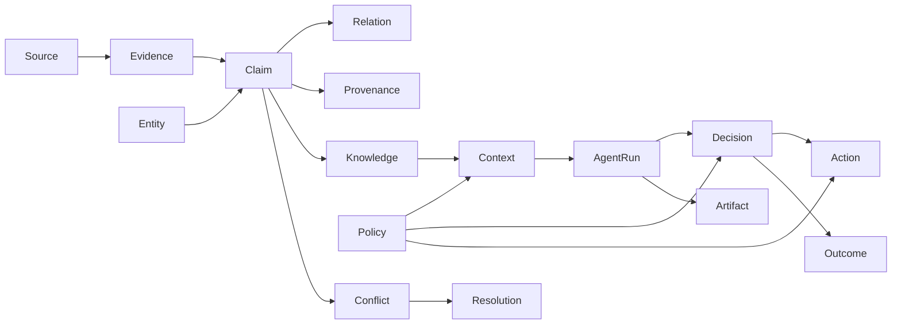

**Claim (canonical record, not an edge):**

```text
Claim {
  id
  subject          // Entity id
  predicate
  object           // Entity id or literal
  assertedAt
  validFrom
  validTo
  recordedAt
  confidence
  status           // asserted | retracted | superseded | conflicted
  evidence[]
  provenance
  namespace
  visibility
  classification
  extractor
  model
  extractionVersion
}
```

This enables contradiction handling, bitemporality, provenance, reprocessing, tenant ACL, confidence, and multiple competing truths.

**Definitions (aligned with product):**

| Primitive  | Meaning                                                    |
| ---------- | ---------------------------------------------------------- |
| Knowledge  | Durable claims about the world                             |
| Context    | Selected knowledge + runtime/task/user state for a purpose |
| Memory     | Experience retained from agent/user activity               |
| Evidence   | Immutable source material                                  |
| Decision   | Recorded choice and observable justification               |
| Policy     | Rules on reads, writes, actions, reasoning                 |
| Provenance | Compact internal lineage; PROV-O at export                 |

**Namespaces (native from day one):**

```text
organization
  ├── workspace / team
  │     ├── project
  │     └── shared agent memory
  └── user
        ├── private knowledge
        ├── private context
        └── private memory
```

Every object: `tenant_id`, `namespace_id`, optional `principal_id`, `classification`, `visibility`, `policy_tags[]`. See [ADR-0010](./adr/0010-namespaces-policy-authorization.md).

### 6.1 Selective events (not full event sourcing)

Immutable events for material semantic changes; ordinary tables for config, UI prefs, connector defs.

```text
claim.asserted | claim.retracted
entity.merged
relationship.asserted
decision.recorded
policy.evaluated
context.accessed
artifact.generated
ontology.version.published
```

Transactional invariant (single kernel transaction):

```text
fact/claim created
  → evidence relationship created
  → provenance event recorded
  → authorization metadata applied
  → outbox event emitted
```

Do not split that across four microservices in v1.

---

## 7. Storage strategy

| Requirement               | Standalone                  | Enterprise                    |
| ------------------------- | --------------------------- | ----------------------------- |
| Canonical entities/claims | SQLite                      | PostgreSQL / AlloyDB          |
| Metadata                  | SQLite                      | PostgreSQL                    |
| Embeddings                | SQLite extension / embedded | pgvector (AlloyDB-compatible) |
| FTS                       | SQLite FTS                  | PostgreSQL FTS                |
| Blobs                     | filesystem                  | GCS (Compose: MinIO)          |
| Graph traversal           | application + recursive SQL | SQL first                     |
| Graph analytics           | embedded                    | worker-generated projection   |
| RDF                       | generated projection        | generated / materialized      |
| Neo4j / Neptune           | optional plugin             | optional plugin               |

Promote a real graph store only after measurement: deep recursion, large-scale algorithms, high-rate traversal, or required Cypher/SPARQL clients.

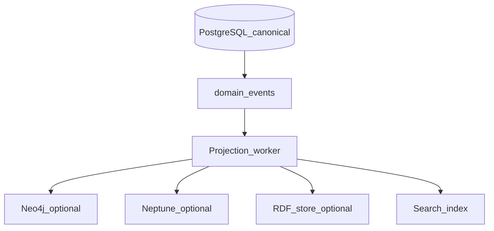

Losing a projection is recoverable. Losing canonical SQL is not.

---

## 8. Plugin architecture

Do not use a generic `initialize()` plugin. Use **typed capabilities**. See [ADR-0001](./adr/0001-kernel-capability-packs-ports.md), [ADR-0006](./adr/0006-vertex-gemini-model-adapters.md).

```typescript
export interface ModelProvider {
  readonly id: string;
  generate(request: GenerateRequest): Promise<GenerateResult>;
}
export interface EmbeddingProvider {
  readonly id: string;
  embed(request: EmbedRequest): Promise<EmbeddingResult>;
}
export interface KnowledgeSource {
  discover(ctx: SourceContext): AsyncIterable<SourceObject>;
  ingest(object: SourceObject): Promise<Evidence>;
}
export interface RetrievalStrategy {
  retrieve(query: RetrievalQuery): Promise<RetrievalResult>;
}
export interface GraphProjection {
  apply(events: readonly DomainEvent[]): Promise<void>;
}
export interface PolicyProvider {
  evaluate(input: PolicyInput): Promise<PolicyDecision>;
}
```

Separate five provider kinds that are often collapsed: `ModelProvider`, `EmbeddingProvider`, `RerankerProvider`, `ExtractionProvider`, `AgentRuntimeProvider`.

Vertex may implement several. OpenRouter may implement a subset. A deterministic extractor may implement `ExtractionProvider` with no LLM.

```typescript
type ModelCapabilities = {
  tools: boolean;
  structuredOutput: boolean;
  images: boolean;
  audio: boolean;
  reasoning: boolean;
  embeddings: boolean;
  maxContextTokens?: number;
};
```

Orchestration queries **capabilities**, not vendor names. Default plugin: `plugins/model-vertex` (Gemini on Vertex AI).

**Manifest (illustrative):**

```yaml
apiVersion: kotowari.dev/v1
kind: Plugin
metadata:
  name: vertex-ai
spec:
  capabilities:
    - model-provider
    - embedding-provider
  permissions:
    network:
      - aiplatform.googleapis.com
  configSchema:
    $ref: ./config.schema.json
```

**Isolation levels**

| Level | Mechanism                          | Use                       |
| ----- | ---------------------------------- | ------------------------- |
| L0    | compile-time package               | trusted first-party       |
| L1    | dynamically loaded trusted package | internal plugins          |
| L2    | child process / sidecar            | untrusted or heavy        |
| L3    | remote service via protocol        | large independent systems |

v1 is L0/L1. Do not pay distributed-plugin cost until isolation is required.

**Contract tests** ship in `plugin-sdk`:

```text
modelProviderComplianceTests(factory)
blobStoreComplianceTests(factory)
knowledgeSourceComplianceTests(factory)
graphProjectionComplianceTests(factory)
```

---

## 9. Ingestion

Pipeline envelope is event/artifact based. Persist intermediates so extraction can be rerun from Evidence.

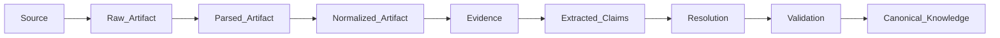

### Sequence: ingest to claims

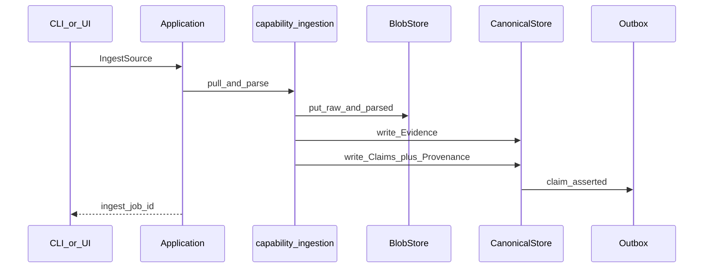

### Sequence: Cloud Run Job re-extract from stored Evidence

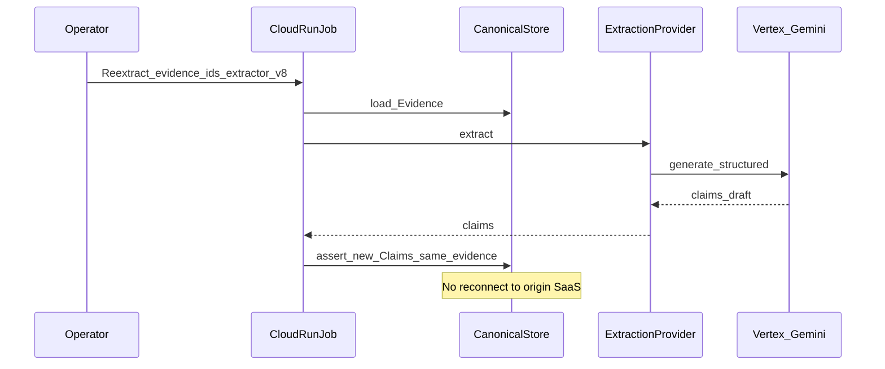

---

## 10. Retrieval

Retrieval is a **declarative plan**, not a GraphRAG microservice.

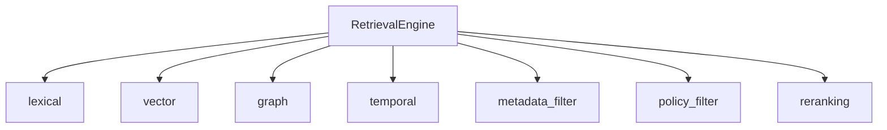

Example plan:

```json
{
  "candidates": [
    { "strategy": "vector", "limit": 50 },
    { "strategy": "graph", "hops": 2 },
    { "strategy": "lexical", "limit": 30 }
  ],
  "rerank": "vertex-gemini",
  "budget": 20,
  "explain": true
}
```

Every hit explains: why selected, source evidence, score components, graph route, policy filtering, freshness.

### Sequence: retrieve, policy filter, build context

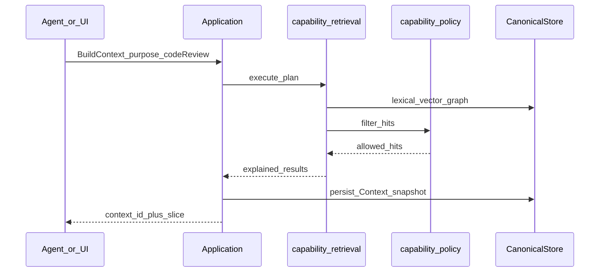

---

## 11. Decisions and provenance

See [ADR-0007](./adr/0007-provenance-mandatory.md), [ADR-0008](./adr/0008-decisions-first-class.md).

**Decision record**

```text
Decision
  inputContextSnapshot
  consideredEvidence[]
  applicablePolicies[]
  selectedOutcome
  alternatives[]
  confidence
  actor
  model / runtime
  resultingActions[]
  observedOutcome?
```

Do not persist hidden chain-of-thought.

**Internal provenance (compact), export PROV-O:**

```text
Provenance {
  source, sourceVersion, actor, process,
  model, promptVersion, extractorVersion,
  timestamp, parentIds[]
}
```

### Sequence: record decision with policy and provenance

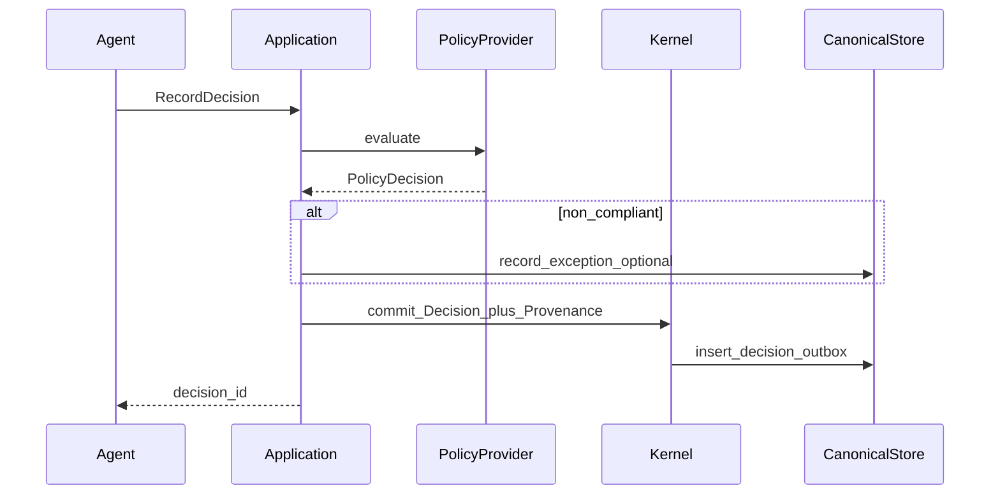

---

## 12. MCP v2 (specification 2026-07-28)

MCP is a **transport adapter**. Python/TS MCP SDKs must not own domain logic. See [ADR-0004](./adr/0004-mcp-v2-transport.md).

**Protocol facts used by Kotowari**

- Stateless core: no required `initialize` handshake, no `Mcp-Session-Id` on the core path.
- Streamable HTTP POST requires `MCP-Protocol-Version`, `Mcp-Method`, `Mcp-Name`. Header/body mismatch → reject (`-32020`).
- Optional `server/discover`. Per-request `_meta` carries version/client/capabilities as required by the spec.
- Authorization: OAuth 2.1-shaped HTTP auth, Protected Resource Metadata, RFC 8707 `resource` audience, RFC 9207 `iss` validation, CIMD preferred, DCR deprecated.
- Extensions: MCP Apps (UI in host), Tasks (long-running). Elicitation via multi-round-trip `input_required` (no sticky stream).
- Stdio remains for **local** IDE plugins talking to standalone Kotowari.
- Serve 2026-07-28 as primary; optionally accept legacy Streamable HTTP during a deprecation window.

**Capability-scoped endpoints** (do not hand every tool to every agent):

```text
/mcp/retrieve
/mcp/knowledge
/mcp/memory
/mcp/ingestion
/mcp/admin
```

### Sequence: MCP v2 tool call (HTTP, no session)

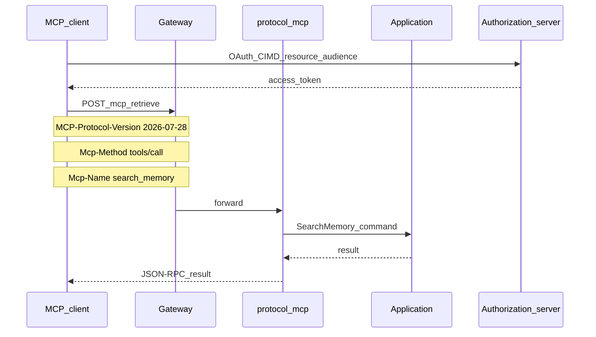

### Sequence: Cursor / Claude plugin to MCP

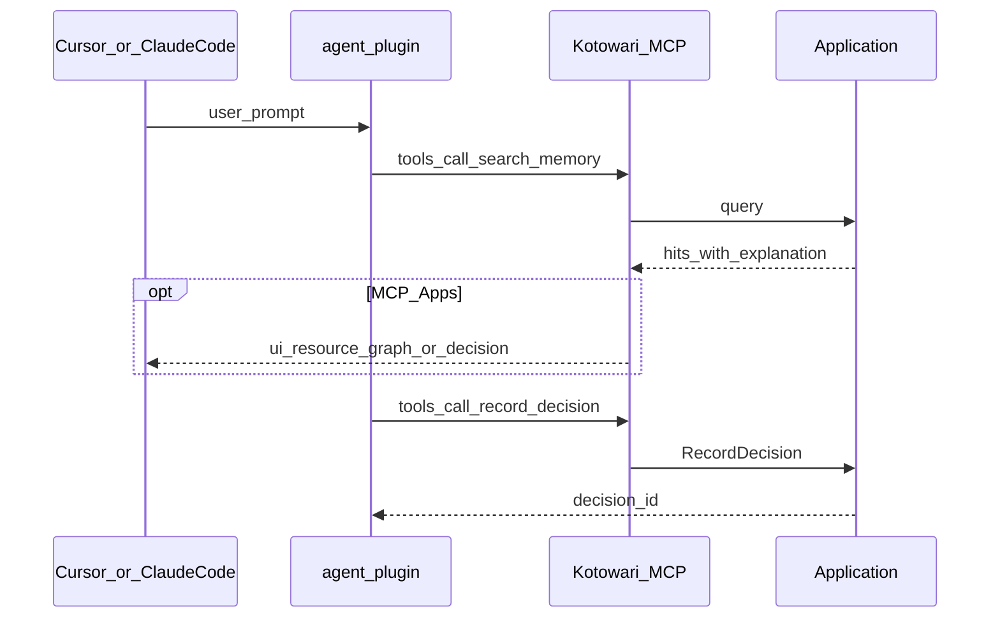

**MCP Apps:** presentation plugins (graph explorer, evidence inspector, decision audit, ontology browser, conflict resolution, policy inspector, retrieval debugger, memory browser). First-party **web app remains required**.

**A2A:** agent-to-agent, not agent-to-tool. Expose a small set of domain agents (research, compliance, curator, investigation) via Agent Cards. Do not expose every worker as an A2A agent. Framework adapters stay tiny: `createAdkTool(client)`, `createClaudeMcpServer(client)`, `createMastraTool(client)`.

---

## 13. Authorization

Not RBAC-as-the-model. RBAC is one **input**. See [ADR-0010](./adr/0010-namespaces-policy-authorization.md).

```text
allow(principal, action, resource, context)
```

Context includes tenant, classification, agent, purpose, delegation.

```text
user A can read document
  → agent acting for user A
  → can retrieve derived claims
  → only while delegated scope permits
```

MCP HTTP and A2A keep identity at the transport/application boundary. Do not stuff bearer semantics into reasoning payloads.

---

## 14. Google Cloud and Terraform modules

GCP-first production profile. High-quality cloud-specific modules; do not invent a fake-neutral runtime. AWS is a **later Terraform module set**, not an inner hexagonal “CloudProvider” that makes both clouds worse.

**Module set** (`infra/terraform/modules/`):

| Module          | Responsibility                                          |
| --------------- | ------------------------------------------------------- |
| `network`       | VPC, serverless connector, private ranges               |
| `identity`      | IAP / OIDC clients, workload identity, service accounts |
| `data`          | AlloyDB or Cloud SQL Postgres, GCS buckets              |
| `runtime`       | Cloud Run service, jobs, worker pools                   |
| `secrets`       | Secret Manager, KMS                                     |
| `observability` | Cloud Trace / OTel, logs, metrics, dashboards           |

Environments (`infra/terraform/environments/`) compose modules. Compose file binds MinIO/Postgres/dev-OIDC to the **same ports** (`BlobStore`, `CanonicalStore`, `IdentityProvider`, `Queue`).

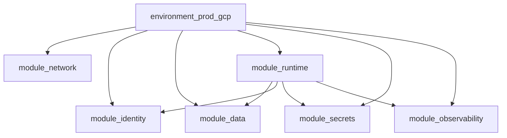

**Default model path:** Vertex AI Gemini (`plugins/model-vertex`) for generate, structured extract, and embeddings where Vertex capabilities match. API keys for other vendors stay in Secret Manager; standalone may use env files / local ADC.

---

## 15. Agent plugins (Cursor, Claude Code, Claude Agent SDK, more)

See [ADR-0009](./adr/0009-agent-plugins-thin-mcp.md).

| Pack                                        | Shape                                                          |
| ------------------------------------------- | -------------------------------------------------------------- |
| Cursor                                      | `.cursor-plugin/plugin.json`, skills, hooks, MCP server config |
| Claude Code                                 | Claude plugin marketplace layout, skills, MCP                  |
| Claude Agent SDK                            | helper that points the SDK at Kotowari MCP/HTTP                |
| ADK / Mastra / DeepAgent / Codex / OpenCode | thin adapters over SDK or MCP                                  |

Skills and tool descriptors are **generated from JSON Schema** so they cannot drift from `contracts.ts`.

Compatibility hierarchy:

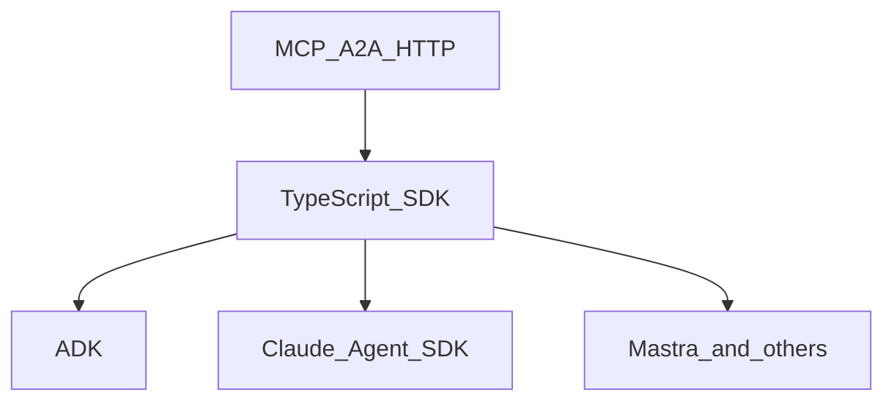

SDK sketch:

```typescript
const client = new KotowariClient({ baseUrl, auth });
const context = await client.context.build({
  subject: { type: 'task', id: taskId },
  purpose: 'code-review',
});
await client.decisions.record({/* ... */});
```

---

## 16. API versioning (three clocks)

Never couple these:

| Clock              | Example                                |
| ------------------ | -------------------------------------- |
| Domain / DB schema | 37                                     |
| Plugin API         | v3                                     |
| Public protocol    | REST v1, MCP capability `knowledge.v2` |
| Ontology           | `customer-domain@7`                    |

---

## 17. Evolution

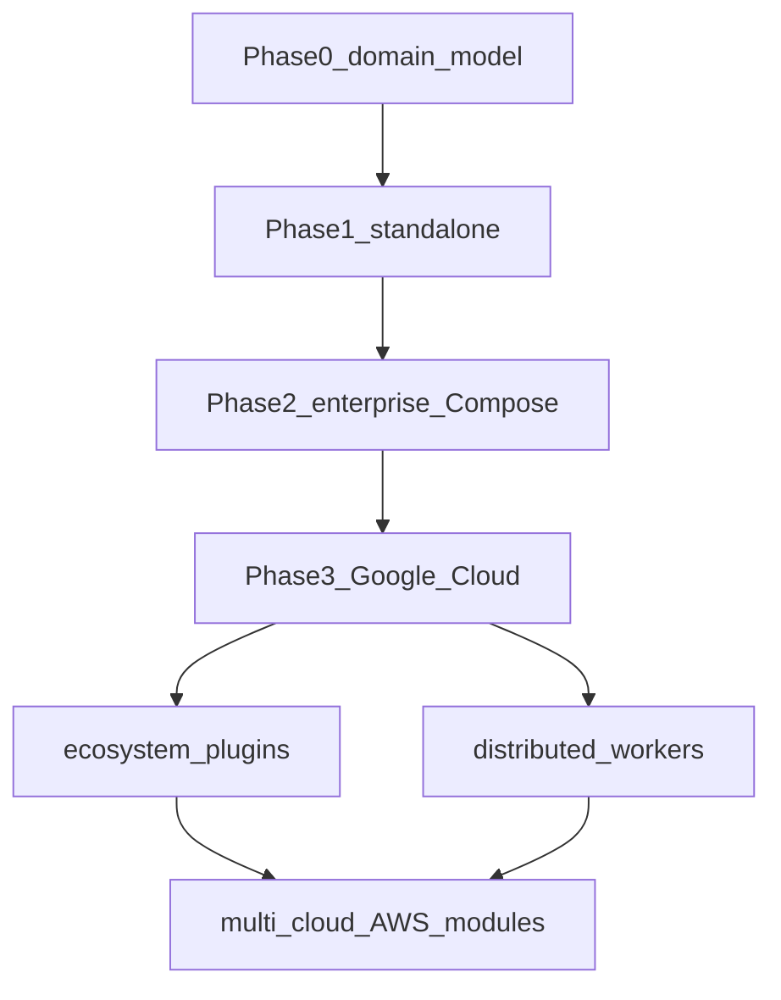

| Phase | Ship                                                                                           |
| ----- | ---------------------------------------------------------------------------------------------- |
| 0     | Entity, Claim, Evidence, Provenance, Context, Decision, Namespace, PolicyDecision + SQLite     |
| 1     | Web, REST, MCP, filesystem ingest, hybrid retrieval, Vertex or local model plugin, plugin SDK  |
| 2     | PostgreSQL, OIDC, tenancy, Compose, worker, MinIO, audit trail                                 |
| 3     | Cloud Run, AlloyDB, GCS, Pub/Sub, Tasks, Secret Manager, Terraform modules                     |
| 4     | A2A, MCP Apps, more providers, L2 plugins, ontology governance, graph projections, AWS modules |

---

## 18. What not to build initially

| Defer                           | Why                       |
| ------------------------------- | ------------------------- |
| Kubernetes                      | Cloud Run sufficient      |
| Required Neo4j                  | PostgreSQL first          |
| Dedicated vector DB             | pgvector first            |
| Generic workflow DSL            | Agent frameworks exist    |
| Own agent framework             | Not the product           |
| Own model gateway               | Adapters first            |
| Own message broker              | Cloud/OSS adapters        |
| Every graph algorithm           | Workers/plugins           |
| Every RDF store                 | Export first              |
| Dozens of connectors            | Plugin ecosystem          |
| Microservices                   | Premature                 |
| Cross-cloud runtime abstraction | Terraform modules instead |

---

## 19. Validation

1. Domain behavior is specified here and in ADRs before picking extra databases.
2. Vertical slice: SQLite → ingest → evidence → claims → retrieval → context → decision → REST/MCP → small web UI.
3. Enterprise parity slice: Postgres, OIDC, object storage, distributed executor; **same contract tests**.

Coding agents should discover from a package: allowed imports, events produced, interfaces implemented, invariants, compatibility tests—without reading 100 files.

**Behavior guarantees, CI gates, and Cursor Cloud definition of done** are specified in [quality-assurance.md](./quality-assurance.md). That document is the authority for what “done” means; this section only names the slices those gates must cover.
